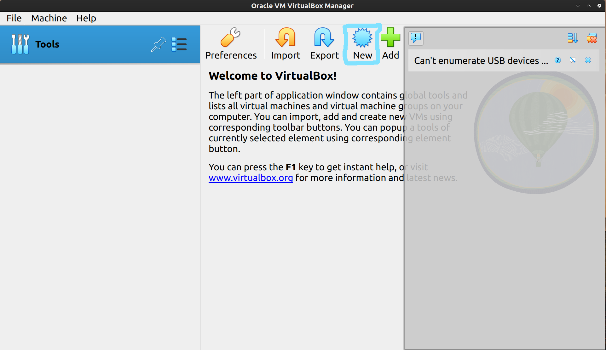

# Born2beRoot

## Description
    "Born to be Root" is a comprehensive guide aimed at empowering individuals who are new to system administration, specifically focusing on mastering the Linux environment. This repository serves as a gateway for beginners to delve into the world of root access and system management with confidence.

    Whether you're a budding enthusiast or a professional seeking to enhance your skills, this guide provides step-by-step instructions, tips, and best practices for navigating Linux systems effectively. From understanding fundamental concepts like file systems, permissions, and processes, to advanced topics such as networking, security, and automation, "Born to be Root" equips users with the knowledge and tools necessary to become proficient in system administration.

    Through clear explanations, hands-on tutorials, and real-world examples, this guide fosters a deeper understanding of Linux administration principles, empowering users to tackle a wide range of tasks and challenges with ease. By embracing the mindset of being 'root' — the superuser with unrestricted access — individuals are encouraged to explore, experiment, and take control of their Linux systems, ultimately unlocking the full potential of their computing environment.

    With "Born to be Root," users embark on a journey of discovery and mastery, gaining the skills and confidence needed to thrive in the dynamic world of Linux system administration. Whether it's setting up servers, troubleshooting issues, or optimizing performance, this guide serves as a trusted companion for anyone seeking to harness the power of Linux and become a true root user.

    For more to understand better what is required I have uploaded the pdf of the subject inside this repository.

## STEP1: Download the VirtualBox

    If you do not have installed VirtualBox you can go at this link https://www.virtualbox.org/ and download it. We will need to use it to install the operating system we want to use.

## STEP 2: Choosing the operating system
    DEBIAN OR ROCKY LINUX

    Based on the requirements provided in the subject, Debian is highly recommended "Born to be Root" project. Here's why:

    1- Stability and Ease of Use: Debian is known for its stability and reliability, making it an excellent choice for a server environment. It has a well-established release cycle and extensive documentation, making it suitable for both beginners and experienced users.

    2- Strong Community Support: Debian has a large and active community with a wealth of resources available online. This support network can be invaluable, especially for those new to system administration.

    3- Suitability for System Administration: The project specifically mentions that Debian is highly recommended for newcomers to system administration. Debian's user-friendly package management system (apt) and comprehensive documentation make it well-suited for learning and implementing the required tasks.

    4- Security Features: Debian comes with robust security features, including SELinux, which must be running at startup and configured according to the project's needs. Additionally, AppArmor must be running at startup for Debian, further enhancing security.

    5- Compatibility with Project Requirements: Debian aligns well with the project's requirements, including setting up encrypted partitions using LVM, implementing a strong password policy, configuring sudo, setting up SSH with restricted access, and configuring the firewall using UFW.

    6- Bonus Part Consideration: If you decide to pursue the bonus part of the project, Debian provides a stable platform for setting up additional services such as WordPress or a custom service of your choice.

    7- The latest version now that im writing this guide is Debian 12.5. Go to this link to download Debian image - https://www.debian.org/download.

Overall, Debian offers a reliable, stable, and well-supported platform that aligns closely with the project's objectives and requirements. It provides a solid foundation for learning system administration and implementing the necessary configurations and tasks outlined in the project description.

## STEP 3: New Virtual Machine with Oracle VirtualBox
    1- Open Oracle VirtualBox
    2- Click on the new command on the top
   
