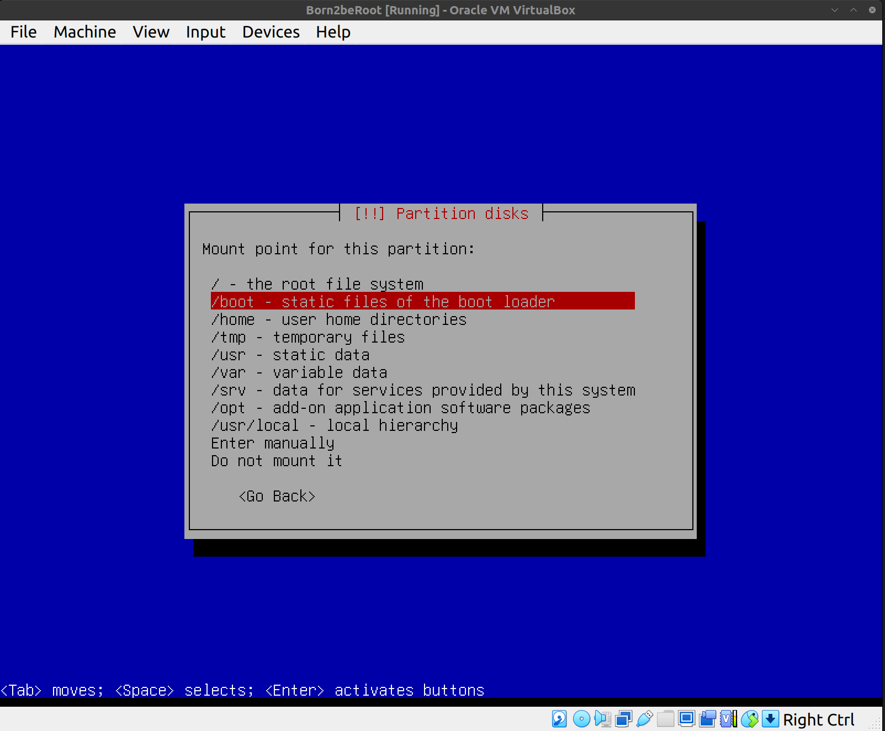
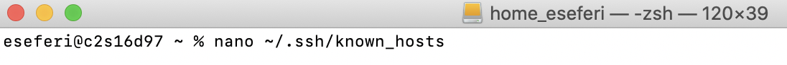
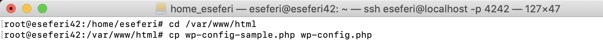
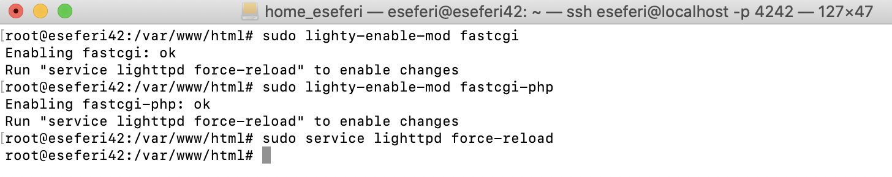
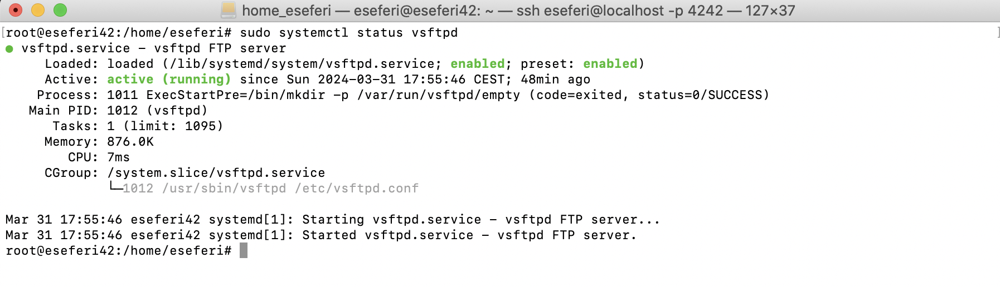

# Born2beRoot

# Description
    "Born to be Root" is a comprehensive guide aimed at empowering individuals who are new to system administration, specifically focusing on mastering the Linux environment. This repository serves as a gateway for beginners to delve into the world of root access and system management with confidence.

    Whether you're a budding enthusiast or a professional seeking to enhance your skills, this guide provides step-by-step instructions, tips, and best practices for navigating Linux systems effectively. From understanding fundamental concepts like file systems, permissions, and processes, to advanced topics such as networking, security, and automation, "Born to be Root" equips users with the knowledge and tools necessary to become proficient in system administration.

    Through clear explanations, hands-on tutorials, and real-world examples, this guide fosters a deeper understanding of Linux administration principles, empowering users to tackle a wide range of tasks and challenges with ease. By embracing the mindset of being 'root' — the superuser with unrestricted access — individuals are encouraged to explore, experiment, and take control of their Linux systems, ultimately unlocking the full potential of their computing environment.

    With "Born to be Root," users embark on a journey of discovery and mastery, gaining the skills and confidence needed to thrive in the dynamic world of Linux system administration. Whether it's setting up servers, troubleshooting issues, or optimizing performance, this guide serves as a trusted companion for anyone seeking to harness the power of Linux and become a true root user.

For more check the [subject](subject.pdf)

# STEP1: Download the VirtualBox

    If you do not have installed VirtualBox you can go at this link https://www.virtualbox.org/ and download it. We will need to use it to install the operating system we want to use.

# STEP2: Choosing the operating system
    DEBIAN OR ROCKY LINUX

    Based on the requirements provided in the subject, Debian is highly recommended "Born to be Root" project. Here's why:

    1- Stability and Ease of Use: Debian is known for its stability and reliability, making it an excellent choice for a server environment. It has a well-established release cycle and extensive documentation, making it suitable for both beginners and experienced users.

    2- Strong Community Support: Debian has a large and active community with a wealth of resources available online. This support network can be invaluable, especially for those new to system administration.

    3- Suitability for System Administration: The project specifically mentions that Debian is highly recommended for newcomers to system administration. Debian's user-friendly package management system (apt) and comprehensive documentation make it well-suited for learning and implementing the required tasks.

    4- Security Features: Debian comes with robust security features, including SELinux, which must be running at startup and configured according to the project's needs. Additionally, AppArmor must be running at startup for Debian, further enhancing security.

    5- Compatibility with Project Requirements: Debian aligns well with the project's requirements, including setting up encrypted partitions using LVM, implementing a strong password policy, configuring sudo, setting up SSH with restricted access, and configuring the firewall using UFW.

    6- Bonus Part Consideration: If you decide to pursue the bonus part of the project, Debian provides a stable platform for setting up additional services such as WordPress or a custom service of your choice.

    7- The latest version now that im writing this guide is Debian 12.5. Go to this link to download Debian image - https://www.debian.org/download.

Overall, Debian offers a reliable, stable, and well-supported platform that aligns closely with the project's objectives and requirements. It provides a solid foundation for learning system administration and implementing the necessary configurations and tasks outlined in the project description.

# STEP 3: New Virtual Machine with Oracle VirtualBox
1- Open Oracle VirtualBox

2- Click on the new command on the top

3- It will prompt to Create Virtual Machine window. Fill the specific fields like in the photo.
If you are not a 42 student you can just store the Machine Folder where you want. After filling
the fields type next.

4- Now we have to set up the memory size we want to use for our VM. You are free to choose
How much memory you want to use from your computer but I would suggest that 1024MB is enough
for this project.

5- Now the next prompts are asking to set up a virtual Hard disk. In the VirtualBox setup process, ensure to select 'Dynamically allocated' for storage on the physical hard disk. This option allows the virtual hard disk file to grow in size as needed, optimizing disk space usage. Avoid checking the option to pre-allocate the full size, as it may lead to unnecessary disk space allocation."

6- So now you should have a summary similar with the photo below. Type finish.

7- After pressing finished you should see your new Vm created like below. You should go to
settings to start with the next step of mounting an ISO file.

# STEP4: Mount iso file and Start VM
1- Controller: Under the "Controller: IDE" or "Controller: SATA" section (depending on your VM's configuration), you'll find an empty optical drive (usually labeled "Empty"). Click on the optical drive.
Attributes: In the attributes section to the right, you'll see a small disk icon next to "IDE Secondary Master" or "SATA Port 1." Click on the disk icon.
Choose a Disk File: In the dropdown menu, select "Choose a disk file..." Navigate to the location of the ISO file on your computer and select it.

2- After choosing Debian ISO image that we dowloaded in the beginning you should have the
same results as below, and then type ok.

3- Now we start the machine by clicking at the Start icon, so we can continue with the next
step to install Debian.

# STEP5: Installing Debian

## 1- Setting up the languange, time zone, keyboard layout
1- It will have the view like below. To have a larger view for your eyes, right click with your
mouse, choose the option Virtual Screen 1 and scale it to 200%. After choose the install 
option since we will use it without Graphical Interface.

2- Now it will ask for the languange im going with English.

3- We enter our Country, territory or area. Since I'm in Germany I will put Other.

4- We select the country. In my case Germany 🇩🇪
First I select Europe.

After I select Germany.

5- Configuring locales: I will go with United States

6- It is important to select American English as the keyboard configuration, otherwise we will have the keys linked incorrectly.

7- Finally by finishing with this step we should the window below;

## 2- Configuring the Network
1- It will first require the hostname which by the subject we have to put the user intraname
followed by 42 -> eseferi42 in my case

2- Domain name. We will leave this section empty, since the subject does not mention anything about Domain name.

3- We must enter a password for the system administration account. It is important to write it 
down or take a photo, since we will use it. If you want to see the password to make sure you 
have written it correctly, you must tab until you reach the Show Password in Clear option, you 
must press the space bar and the password will be displayed. So you should see something like
the photo below:

4- Now we have to reconfirm our password

5- For not using the root account for non-administrative activities it will request to create
a normal user account. Since for the root account I put eseferi42 for the user I'm writing
eseferi

6- Now it will require a nickname or username for this non-root user, but I'm proceeding with 
the previous User name also for the nickname;

7- We have to choose a password for the Non-root user, I'm proceeding with the same as for the
Root User, Kinda have bad memory 🥱

8- Again we have to confirm the password. As I showed while setting the passord for the root user, we can move with arrows do show password and press space.

## Setting up the partitions
Partitioning is essential for organizing disk space on your server. It divides the disk into separate sections, each serving a specific purpose.

1- use entire disk and set up encrypted LVM: This refers to selecting the guided partitioning 
option in the installation process, which will automatically partition the disk and set up 
encrypted Logical Volume Manager (LVM). This option is chosen because the project specifies 
that encrypted partitions must be used. 
BUT...
⚠️❗️ If you want to do the bonus you must click Manual and click here ❗️⚠️: This part serves 
as a reminder or alert for users who wish to complete the bonus part of the project. It 
instructs them that if they want to deviate from the automatic guided partitioning and set up 
the partitions manually (which may be necessary for certain bonus tasks), they should select 
the "Manual" option instead. I will do first what is required for the bonus but if you want 
you can skip it and go straight here.

2- In this section it shows us a general description of our partitions and mount points. 
Currently, we do not have partitions made. To create a new partition table we must choose the 
device where we want to create them. In our case we will choose the only one available, 
SCSI2 (0, 0, 0) (sda) - 32.2 GB ATA VBOX HARDDISK in my case. Don't be confused if you have
SCSI3 because in VirtualBox, the SCSI controller number is assigned automatically by the   
software and may vary between installations or configurations. It's essentially a virtual 
representation of the disk controller used by the virtual machine. As long as you're referring 
to the correct disk (sda) and its capacity (32.2GB ATA VBOX HARDDISK), you should be fine.

3- Click yes to confirm the device

4- Once we have completed the previous step we can see how our empty partition table appears. 
Now we must configure it, to do this we must select the FREE SPACE to create the partitions.

5- Create new partition

6- Taking the subject's image how the partitions should be we will create them one by one

7- As the subject indicates, the size of the partition must be 500 megabytes.

8- Brief description of all types of partitions:

    ◦ Primary: The only partition on which an OS can be installed. There can only be 4 primary partitions per hard drive or 3 primary and one extended.

    ◦ Secondary/Extended: It was designed to break the limitation of 4 primary partitions on a single physical disk. There can only be one partition of this type per disk, and it is only used to contain logical partitions.

    ◦ Logical: Occupies a portion of the extended/primary partition or its entirety, which has been formatted with a specific type of file system (in our case we will use ext4) and a drive has been assigned to it, thus the system The operating system recognizes the logical partitions or their file system. There can be a maximum of 23 logical partitions in an extended partition, however, Linux, the OS we currently work with, reduces this to 15, more than enough to carry out this project.
For this step we will choose primary since it will be the partition where the Operating System will be installed.

9- We will select beginning since we want the new partition to be created at the beginning of 
the available space.

10- The following screenshot shows us the details of the partition. We will modify the mount 
point to which the subject specifies.

11- We choose boot as the mount point of our partition.

12- We finish configuring the current partition.

13- Once we have completed the previous step, the partition should appear. Now we must create 
a logical partition with all the available disk space, which has no mount point and which is 
encrypted. To do this, we select the free space where we want to create it.

14- Create new partition

15- We will use the example from the subject

16- We select max for this partition

17- Since we have to create The LVM we have to choose Logical

18- Select the mount point

19- in the context of virtual machines (VMs) and disk management, logical partitions are       
typically not mounted directly because they are part of a larger virtual disk image or disk 
file. 

20- Finish this partition

21- Lets configure the encrypred volumes now

22- Accept the confirmation message.

23- We start to create encrypted volumes.

24- We select which partition we want to perform the encryption on. Move with arrows to 
/dev/sda5/ and select it with space.

25- We finish configuring the current partition.

26- We are done, since we do not want to create more encrypted volumes.

27- We accept the confirmation message which tells us that everything inside the partition 
will be encrypted and that it shouldn't take long to finish.

28- We don't care if it takes a long time or a short time, we click cancel, since there is 
nothing to encrypt, because the partition is empty.

29- Again we will have to enter a password, this time it will be the encryption phrase. As I 
have previously told you, you must repeat the process and you must write it down, since it 
will be important in the future.

30- Confirm the password

31- We will configure the logical volume manager.

32- We will accept the confirmation message, since we agree that the changes will be saved to  
disk.

33- Let's create a new volume group. Volume groups group partitions together.

34- We have to give the name as indicated in the subject: LVMGroup.

35- Select the partition where we should create the group.

36- We have to create them as the example in the subject

37- We will start by choosing the group where we want them to be created. We select the only 
one available (the one we just created).

38- The order of creating the logical units will be the same as indicated in the subject, so 
we will start with root and end with var-log. Then we will select the name of the logical 
volume.

39- Size, as the subject indicates, will be 10g.

40- To not cause repetition, go on and do the same for all partitions in the group volume
and give the same name and size the same as in the example above

41- If you made them all you should have exact window like below, and type finish.

42- Now we can see how in the section where they show us all our partitions and free space, 
all the logical partitions that we just created already appear. Well, we must configure all of 
them to select the file system we want and the mount point indicated by the subject. Again we 
will go in order and select by pressing enter the first one that appears to us, which is home.

43- It shows us the partition configuration. We must choose a file system since it currently does not have one by pressing with enter at use as do not use.

44- Choose the Ext4 file system, it is the most used file system in Linux distributions.

45- We must select the mount point by pressing enter on it

46- For home select home and for others in the future choose the specific for them to not
repeat the same thing

46- Done setting up partition

46- Go now and do the same for all partitions.
Only for the var/log you have to enter the mounting point manually and for the swap do not 
choose Journalist File System but choose swap area after you click use as do not use.
In the end Finish partitioning and write changes to disk.

Confirm and after it you will see the installation bar.

47- It will ask for us to install additional packages but we select no since we don't need them

48- Choose the country that is specific to you.

49- I choose deb.debian.org, since taking into account my region, it is where we will have a
better connection.

50- Leave this field empty and continue.

51- We do not want developers to see our statistics so select no

52- We will remove all software options (with the space bar) and click Continue
since in the subject they are forbidden.

53- We will select Yes to install GRUB boot on the hard drive.
GRUB plays a crucial role in the boot process of Linux-based operating systems, providing a flexible and customizable bootloader solution that facilitates system booting, kernel loading, and system recovery.

53- Next choose the device for the /dev/sda bootloader installation (ata_VBOX_HARDDISK).

54- Type continue to finish the installation.

Now your system will open and ask for password lets jump to the next steps :)

# STEP6: Virtual Machine Configuration

1- The first thing we must do is select Debian GNU/Linux.
We must enter the encryption password that we previously used.

2- Enter Non root user username and password

We now have everything ready to start configuring our Debian virtual machine 🥳

## Installing sudo and configuring users and groups

1- To install sudo we must first be in the root user, to do this we will put Su in the 
terminal and enter the root password. Once we have accessed the root user, we must enter the 
apt install sudo command to install the necessary packages.

2- We must restart the machine for the changes to be applied. To do this we will use the sudo reboot command and wait for it to reboot.

3- Once restarted we must re-enter the encryption and user passwords. To verify that we have 
installed sudo correctly, we will enter the root user again and enter the command sudo -V. 
This command, in addition to showing us the version of sudo, will also show the arguments 
passed to configure when sudo was created and the plugins that can show more information. 
Optional: Since the output of the command is very long, if we want to see it completely we 
must redirect its output to a file sudo -V > file.txt and then edit the file nano file.txt. Or 
put | more after the command.

4- Continuing with the root user, we will create a user with the name of our non root user
which is loged in with the command sudo adduser login, as we have already created the user in 
the installation, it should appear that the user already exists.

5- Now we will have to create a new group called user42. To create it we must do sudo addgroup 
user42.

🤔 Ever heard of GID? It stands for Group Identifier, abbreviated as Group ID. Essentially, it's a unique identifier assigned to a group 🆔 in a Unix-like operating system. Just like how each user has a UID (User ID), each group gets its own GID. This identifier helps the system manage permissions and access control, allowing users within the same group to share resources and collaborate effectively. So, think of GID as the group's digital fingerprint—it ensures smooth coordination and organization within the operating system!

🤔 Has the group been created correctly? The truth is that yes, since there has been no error message, we can still check if it has been created with the command getent group group_name or we can also do cat /etc/group and we can see all the groups and users there are inside them.

And this will be the output of <b>cat /etc/group</b>

6- With the command <b>sudo adduser user group</b> we will include the user in the group. We 
must include the user in the sudo and user42 groups.
Once we have entered them, to check that everything has been done correctly, we can execute 
the command getent group group_name or we can also edit the file /etc/group nano /etc/group 
and our user should appear in the sudo and login42 groups.

## Installation and Configuration of SSH
🔒 SSH, or Secure Shell, is both a protocol and a program used for remote access to servers. It establishes a secure channel, encrypting all data exchanged between the client and server. This ensures confidentiality and integrity, making SSH a vital tool for secure remote administration and file transfer.

1- The first thing we will do is do sudo apt update to update the repositories that we defined 
in the /etc/apt/sources.list file

2- Next we will install the main connectivity tool for remote login with the SSH protocol, 
this tool is OpenSSH. To install it we must enter the command <b><i>sudo apt install openssh-server</i></b>. 
In the confirmation message we put Y, then we will wait for the installation to finish.

You should see something like below:

To check that it has been installed correctly we will do <b><i>sudo service ssh status</i></b> and it should appear active.

3- After completing the installation, there are configuration files we need to adjust. We'll 
utilize Nano, or any preferred text editor, for this task. The initial file to modify is 
located at /etc/ssh/sshd_config. If you're not logged in as the root user, writing permissions 
may be restricted. In such cases, you can either switch to the root user using 'su' followed 
by the root password, or alternatively, prepend 'sudo' to the command, like so: '<b><i>sudo nano etc/ssh/sshd_config</b></i>'."

🕒 By the way, if you're planning to take a break like I did between sections, I highly 
recommend creating a snapshot of your virtual machine before shutting it down. You can do this 
easily by navigating to the 'Machine' menu at the top of your VM window, selecting 'Take 
Snapshot,' and giving it a name. This way, when you restart your machine later, you can simply 
use this snapshot to restore it to its previous state. 📸

This is the way how you can start it 

Let's go back where we left it. The # at the beginning of a line means that it is commented, 
the lines that we are going to modify you must remove the comment. Once we are editing the 
file we must modify the following lines:

#Port 22 -> Port 4242
#PermitRootLogin prohibit-password -> PermitRootLogin no

4- Now we must edit the file /etc/ssh/ssh_config.

Uncoment the Port 22 and change it to 4242

7- Finally, we must restart the ssh service so that the modifications we have just made are 
updated. To do this we must write the command <b><i>sudo service ssh restart</b></i> and once 
reset we will look at the current status with sudo service ssh status and to confirm that the 
changes have been made to the server listening, Port 4242 should appear.

## Installing and Configuring UFW
🔒 UFW, or Uncomplicated Firewall, is a user-friendly front-end for managing iptables, the default firewall configuration tool for many Linux distributions. It simplifies the process of configuring firewall rules through a straightforward command-line interface, allowing users to easily control network traffic and enhance system security with just a few simple commands. With UFW, even users with limited experience in firewall management can efficiently set up and maintain robust firewall policies to safeguard their systems against unauthorized access and potential threats.

1- 🛡️ To begin, the initial step is to install UFW. Execute the command <b><i>sudo apt 
install ufw</b></i> in your terminal. When prompted, type 'y' to confirm your intention to 
install the package, then patiently wait for the process to complete. This sets the stage for 
configuring your firewall and bolstering your system's security.

2- 🔥 Once UFW is installed, the next crucial step is to enable it. Simply enter the command 
<b><i>sudo ufw enable</b></i> in your terminal. Upon execution, you should receive an 
immediate indication confirming that the firewall is now active. This ensures that your system 
is fortified against unauthorized access, bolstering its overall security posture.

⚙️ Now, let's configure our firewall to allow connections through port 4242. Execute the command sudo ufw allow 4242 in your terminal. This command ensures that traffic on port 4242 is permitted, enabling smooth communication for your desired services or applications.

🔍 Lastly, let's ensure everything is correctly configured by checking the status of our firewall. Execute the command sudo ufw status in your terminal. Here, you should observe connections through port 4242 already listed as allowed. This provides reassurance that your firewall is effectively safeguarding your system while permitting necessary communications.

## Set strong password for sudo 

1- 🔐 Next, we'll create a file at the path /etc/sudoers.d/ to store our password configuration. I've opted to name the file sudo_config for clarity. Execute the command touch /etc/sudoers.d/sudo_config in your terminal to create the file. This file will play a crucial role in managing password settings securely.

2- 📁 To meet the requirement of storing all sudo commands' input and output, we need to create a directory named sudo within the /var/log path. Execute the command mkdir /var/log/sudo in your terminal to create this directory. This ensures that all sudo activities are centrally logged, aiding in system administration and security monitoring.

3- ✏️ Now, let's edit the file created in the previous step. As mentioned earlier, you can use your preferred text editor, but for simplicity, I'll demonstrate using nano. Execute the command nano /etc/sudoers.d/sudo_config in your terminal to open the file for editing. This step allows us to configure password policies securely and effectively.

## Strong Password Policy Settings 🔑

1- The first step will be to edit the login.defs file.

2- PASS_MAX_DAYS 99999 -> PASS_MAX_DAYS 30  
PASS_MIN_DAYS 0 -> PASS_MIN_DAYS 2

🔐 Let's delve into configuring password policies:

    PASS_MAX_DAYS: This parameter sets the expiration time for passwords, with the number 
    representing the duration in days.

    PASS_MIN_DAYS: Here, you define the minimum number of days a password must be used before 
    it can be changed.

    PASS_WARN_AGE: This setting triggers a warning message to users, notifying them of the 
    impending expiration of their password within the specified number of days.

3- 🛠️ To proceed with the configuration, we need to install the necessary packages. Execute 
the command sudo apt install libpam-pwquality in your terminal. When prompted, type 'Y' to 
confirm the installation and patiently wait for it to complete. These packages provide 
additional password quality checking capabilities, enhancing the security of your system.

4- 🔐 Next, let's revisit editing a file and modify some lines. Use the command nano /etc/pam.
d/common-password in your terminal to open the file for editing. This step allows us to 
configure password policies effectively within the system's common password handling 
configuration.

5- After retry=3 we must add the following commands:
    
    minlen=10
    ucredit=-1
    dcredit=-1
    lcredit=-1
    maxrepeat=3
    reject_username
    difok=7
    enforce_for_root

🤔 Let's break down each command:

    minlen=10: Sets the minimum number of characters required for a password.

    ucredit=-1: Specifies that the password must include at least one uppercase letter.

    dcredit=-1: Requires the presence of at least one digit in the password.

    lcredit=-1: Ensures the password contains at least one lowercase letter.

    maxrepeat=3: Limits the repetition of the same character to a maximum of 3 times consecutively.

    reject_username: Prohibits the password from containing the username.

    difok=7: Specifies that at least 7 characters in the new password must differ from the old password.

    enforce_for_root: Enforces these password policies for the root user, enhancing security even for privileged accounts.

## Connect from SSH 

1- Before closing the virtual machine, don't forget to save a snapshot through VirtualBox's 
configuration settings. This ensures that you can easily revert to the current state of the 
machine if needed. Simply navigate to the snapshot manager and create a snapshot with a 
descriptive name. This precautionary measure safeguards your progress and configurations while 
preparing for SSH connectivity.
🔒 To establish an SSH connection, start by closing the virtual machine. Then, open VirtualBox and navigate to the machine's configuration settings. This step allows us to adjust network settings and enable SSH connectivity for the virtual machine.

And set the port

2- To connect to the virtual machine from the host machine, open a terminal on the host and type 

	ssh eseferi@localhost -p 4242. 

This command initiates an SSH connection to the virtual machine, specifying the username 
eseferi and port 4242. You'll be prompted to enter the user password. Once authenticated, the 
login prompt will appear in green, indicating a successful connection. In case you are having a 
problem like below: 

The error message you received indicates that the ECDSA key for the host localhost on port 4242 has changed since the last time you connected, and your SSH client is configured to perform strict host key checking, which prevents the connection due to this change.

Go on and type in your terminal

	nano ~/.ssh/known_hosts

Delete the line that looks like [localhost]:4242 ecdsa-sha2-nistp256 AAAA...
Save the file and then try connecting again.

After try again to connect with 

	ssh eseferi@localhost -p 4242.

And it should ask for the password of the non root user like below:

Have your machine open while you connect with shh.

## 📜 Writing the script

Entering this section requires careful attention to detail. It's crucial to grasp everything 
presented here. Avoid taking shortcuts! During evaluation, you'll likely be questioned about t
the script's functionality or how it operates.

📝 What is a script? It is a file containing a sequence of commands. When executed, these 
commands perform the functions specified within the script.

1- System Architecture

To display the system's architecture, utilize the uname -a command. This command prints comprehensive information, excluding cases where the CPU or platform hardware is unknown.

2- Physical Cores

To determine the number of physical cores, access the file /proc/cpuinfo, which provides CPU-related information such as type, brand, model, and performance. Use the command grep "physical id" /proc/cpuinfo | wc -l to count the number of physical core identifiers.

3- Virtual Cores

Similarly, to ascertain the number of virtual cores, again access the file /proc/cpuinfo. This time, use the command grep processor /proc/cpuinfo | wc -l to count the number of processor identifiers.

4- RAM

To view RAM memory details, utilize the free command, which provides real-time information about RAM usage, free space, and resources reserved for other purposes. For more detailed command information, refer to free --help. Use free --mega to display memory metrics in megabytes.

After executing this command, filter the output to display only the relevant information. To display used memory, use awk to process the output text files. The command free --mega | awk '$1 == "Mem:" {print $3}' prints the used memory.

To obtain total memory, use a similar command, but print the second word of each row instead of the third. Use free --mega | awk '$1 == "Mem:" {print $2}' to achieve this.

Finally, calculate the percentage of used memory. Use printf to format the output to display only two decimal places. The command free --mega | awk '$1 == "Mem:" {printf("(%.2f%%)\n", $3/$2*100)}' accomplishes this.

5- Disk Memory

To view disk memory usage, use the df command to obtain a summary of disk space usage. Specify the -m flag to display memory metrics in megabytes. Filter the output to display only relevant information using grep and awk. The command df -m | grep "/dev/" | grep -v "/boot" | awk '{memory_use += $3} END {print memory_use}' sums up the memory usage.

To obtain total disk space, use a similar command, but sum up the values in the second column instead of the third. Additionally, convert the result to gigabytes if necessary. The command df -m | grep "/dev/" | grep -v "/boot" | awk '{total_size += $2} END {print total_size/1024}' achieves this.

To display the percentage of used memory, combine the previous commands to calculate the percentage and format the output accordingly. The command df -m | grep "/dev/" | grep -v "/boot" | awk '{use += $3} {total += $2} END {printf("(%.2f%%)\n", use/total*100)}' accomplishes this.

6- CPU Usage Percentage

To determine the CPU usage percentage, utilize the vmstat command to obtain system statistics. Specify an interval and use tail to select the last line of output. Then, use awk to print the desired column. The command vmstat 1 4 | tail -1 | awk '{print $15}' displays the available memory usage.

Subtract the value obtained from 100 to determine the CPU usage percentage. Print the result with one decimal place and a "%" symbol. This operation completes the script.

7- Last Reboot

To view the date and time of the last system reboot, use the who -b command. Filter the output to display only the relevant information using awk. The command who -b | awk '$1 == "system" {print $3 " " $4}' prints the last reboot date and time.

8- LVM Active

To check if LVM (Logical Volume Manager) is active, use the lsblk command to show block device information. Filter the output using grep to search for LVM. Based on the result, print "Yes" or "No" accordingly. The command if [ $(lsblk | grep "lvm" | wc -l) -gt 0 ]; then echo yes; else echo no; fi accomplishes this.

9- TCP Connections

To determine the number of established TCP connections, we will utilize the ss command, which has replaced the now obsolete netstat. We will filter the output with the -ta flag to display only TCP connections. Then, we will use grep to identify established connections, as there are also connections in the listening state. Finally, we will count the number of lines using wc -l. The command is as follows: ss -ta | grep ESTAB | wc -l.

10- Number of Users

We will use the users command, which displays the names of active users. To count the number of words in the command output, we will use wc -w. The entire command is as follows: users | wc -w.

11- IP Address & MAC

To obtain the host's IP address, we will use the hostname -I command. For the MAC address, we will use the ip link command, which shows or modifies network interfaces. Since multiple interfaces, IPs, etc., are displayed, we will use grep to search for the desired information and print only what is requested. Use the command ip link | grep "link/ether" | awk '{print $2}' to display only the MAC address.

12- Number of Commands Executed with sudo

To obtain the number of commands executed with sudo, we will use the journalctl command, which collects and manages system logs. Specify _COMM=sudo to filter entries by the specified path. Once the search is filtered, further refine it by using grep COMMAND to display only command lines. Finally, use wc -l to count the lines. The entire command is as follows: journalctl _COMM=sudo | grep COMMAND | wc -l. To verify its correctness, execute the command in the terminal, run a sudo command, and then rerun the command to confirm that the count increases.

13- This is how the script should look

⚠️ Remember not to copy and paste commands without understanding their functions. ⚠️

From your ssh connection open in super user mode and nano monitoring.sh to create the bash file

And write the script inside like below

After running the script

## Crontab

🧠 What is Crontab?
Crontab is like the timekeeper of your system. It schedules background tasks to run at specific 
times or intervals. This enables automation of repetitive tasks without manual intervention.

To configure crontab properly, you'll need to edit the crontab file using the command sudo 
crontab -u root -e.

Within the file, you'll add the following command to execute your script every 10 minutes: */10 
\* \* \* \* sh /path/to/your/script.

Remember, crontab is a powerful tool, but it requires careful configuration to ensure tasks run 
smoothly and efficiently. 🕒

So after typing 

	sudo crontab -u root -e

You should configure the crontab file

Operation of each crontab parameter:

	* m: Represents the minute when the script will be executed. Valid values range from 0 to 59.

	* h: Indicates the hour in the 24-hour format. Values range from 0 to 23, where 0 represents midnight (12:00 AM).

	* dom: Stands for the day of the month. For example, setting it to 15 would execute the script on the 15th day of each month.

	* dow: Denotes the day of the week, either as a numeric value (0 to 7, where 0 and 7 represent Sunday) or using the first three letters of the English day names: mon, tue, wed, thu, fri, sat, sun.

	* user: Specifies the user who will execute the command. This can be root or another user with appropriate permissions to run the script.

	* command: Refers to the command or the absolute path of the script to be executed.

# STEP7: Wordpress & services configuration 

🧠 What is Lighttpd? Lighttpd is a web server engineered to deliver exceptional speed, 
security, flexibility, and adherence to web standards. It's tailored for environments 
prioritizing speed, as it requires fewer CPU and RAM resources compared to alternative servers.

1- Installation

	sudo apt install lighttpd

2- Allow connections through port 80

	sudo ufw allow 80

3- Check if the port is allowed

	sudo ufw status

4- We include the rule that encompasses port 80. If you're uncertain about how to add rules in 
port forwarding, navigate to Machine configuration → Network → Port forwarding, and replicate 
the capture.

## WordPress

💡 What is Wordpress? It is a content management system focused on the creation of any type of
website, offering extensive customization and flexibility.

1- Installation
First install <b><i>wget and zip</b></i>

	sudo apt install wget zip

💡 What is wget? It is a versatile command-line tool used for downloading files from the internet.  
💡 What is zip? It is a command-line utility for compressing and decompressing files in ZIP format.  

2- We have to go to <b><i>www</b></i> directory inside <b><i>var</b></i> and download the 
latest english version of WordPress.

	cd /var/www/
	sudo wget https://wordpress.org/latest.zip

3- Unzip the dowloaded file

	sudo unzip latest.zip

4-  Rename html folder and call it html_old. Rename wordpress folder and call it html.

	sudo mv html/ html_old/
	sudo mv wordpress/ html

5- Set the permissions on html folder.

	sudo chmod -R 755 html

## Mariadb

💡 What is MariaDB? MariaDB is a robust relational database management system (RDBMS) that 
offers high performance, scalability, and reliability. It is widely used for various purposes, 
including data warehousing, e-commerce, enterprise-level functions, and logging applications.

1- Installation

	sudo apt install mariadb-server

2- Securing Mariadb

Due to the default configuration leaving your MariaDB installation unsecured, we will utilize a 
script provided by the mariadb-server package to enhance security by restricting access to the 
server and removing unused accounts. Execute the script using the following command: sudo 
mysql_secure_installation. During execution, you may be prompted to switch to Unix socket 
authentication. As we already have a protected root account, select 'N' to decline the switch.

	sudo mysql_secure_installation

3- Access mariadb.

	mariadb

4- Create a database for Wordpress

	CREATE DATABASE wp_database;

5- Create a user inside database and grant privileges to it and update the permissions

	CREATE USER 'eseferi'@'localhost' IDENTIFIED BY '12345';
	GRANT ALL PRIVILEGES ON wp_database.* TO 'eseferi'@'localhost';
	FLUSH PRIVILEGES;

6- Exit

	exit

## PHP

💡 What is PHP? PHP, a widely-used programming language, primarily serves for the development of dynamic web applications and interactive websites. Notably, PHP executes on the server side.

1- Install necessary packages to run web applications written in PHP language and that need to connect to a MySQL database

	sudo apt install php-cgi php-mysql

2- Configure worpress. Lets start by going to html and copying wp-config-sample.php and renaming to wp-config.php

	cd /var/www/html
	cp wp-config-sample.php wp-config.php

3- Edit wp-config.php

	nano wp-config.php

and modify from 

to 

4- Activate the fastcgi-php module in Lighttpd to enhance the performance and speed of web 
applications on the server, and update it in the end

	sudo lighty-enable-mod fastcgi
	sudo lighty-enable-mod fastcgi-php
	sudo service lighttpd force-reload

5- Go to your browser and type localhost

6- Fill on the fields and press on <b><i>Install WordPress</i></b>

7- If you sign in you will se your Wordpress dashboard

8- If we access our localhost again from the browser, we can observe our functional page.

# STEP8: Installing FTP as an optional service from the subject

1- Install ftp, check if it is installed and allow the port 21 with ufw

	sudo apt install vsftpd
	dpkg -l | grep vsftpd
	sudo ufw allow 21

2- Configure ftp by configuring vsftfpd.conf file

	sudo nano /etc/vsftpd.conf

	uncomment write_enable=YES

It was like this

Now it should be like below

Navigate to the /home/user/ directory in my case /home/eseferi and write this commands

	cd /home/eseferi/
	sudo mkdir ftp
	cd ftp
	sudo mkdir files
	cd ..
	sudo chown nobody:nogroup ftp
	sudo chmod a-2 ftp
	user_sub_token=$USER
	local_root=/home/$USER/ftp

	These lines are shell commands used to set up a basic FTP directory structure and permissions. Let's break down each line:

	sudo mkdir /home/<user>/ftp: This command creates a new directory named "ftp" within the home directory of the specified user. Replace <user> with the actual username.

	sudo mkdir /home/<user>/ftp/files: This command creates a subdirectory named "files" within the "ftp" directory created in the previous step.

	sudo chown nobody:nogroup /home/<user>/ftp: This command changes the ownership of the "ftp" directory to the user and group "nobody:nogroup". This is often done for security purposes to restrict access to the FTP directory.

	sudo chmod a-w /home/<user>/ftp: This command removes the write permission for all users (owner, group, and others) from the "ftp" directory. This ensures that users cannot write or modify files within the directory, only read them.

	user_sub_token=$USER: This line sets the variable user_sub_token to the value of the current user's username.

	local_root=/home/$USER/ftp: This line sets the local_root parameter to the path of the FTP directory for the current user. The $USER variable is replaced with the current user's username. This parameter defines the root directory for the user when they log in via FTP, restricting their access to only the specified directory and its subdirectories.

Open again vsftpd.conf

	nano vsftpd.conf

And uncommend chroot_local_user=YES o prevent user from acessing files or using commands outside the directory tree

so from commented

to uncommented like below

3- Create an empty user list file with this command

	sudo nano /etc/vsftpd.userlist

You should see an empty file like this 

save the file and after run this command in terminal

	sudo nano /etc/vsftpd.userlist

open again vsftpd.userlist file with nano 

	sudo nano /etc/vsftpd.userlist

and add this lines 

	userlist_enable=YES
	userlist_file=/etc/vsftpd.userlist
	userlist_deny=NO

You should have something like this 

4- Add the port 21 in you VMbox 

5- Check Ftp status

	sudo systemctl status vsftpd

We can also check if it is listening in port 21

	sudo ss -tuln | grep :21

The output indicates that there is a service listening on port 21, which is typically the port used by the 
FTP service. Here's what the output means:

	tcp: Indicates that the listening socket is using the TCP protocol.

	LISTEN: Indicates that the socket is in the listening state, waiting for incoming connections.

	0 32: This column indicates the receive queue length and send queue length for the socket. In this 
	case, 0 indicates that there are no connections in the receive queue, and 32 indicates the maximum 
	queue length for pending connections.

	*:21: Indicates that the service is listening on all available network interfaces (*) on port 21.
	
	*:*: Indicates that the service is listening on all available network interfaces for any source port.

Based on this output, it appears that there is a service listening on port 21, which is likely your FTP service. This confirms that FTP is indeed enabled and running on your system.

6- You can connect from the real pc to your virtual easily with ftp \<ip\> and play with it (ip would be equal with the localhost ip 127.0.0.1)
But I want to make it a little bit more interesting and since I'm working on mac I will download Cyberduck
from this link https://cyberduck.io/download/ and installit.

You should see something like below

Press on oppen connection and fill the required fields

Good job now you are connected and you can receive and send files with ftp

🎉 Thank you for embarking on this journey with me! I trust that this guide has been a valuable resource for you, helping you navigate through your tasks smoothly. If you found this guide helpful and informative, consider showing your support by starring this repository. Your encouragement fuels my passion to create more helpful content and enhance existing guides. Don't hesitate to reach out if you have any feedback, suggestions, or questions. Keep shining and happy exploring! 🚀🌟
